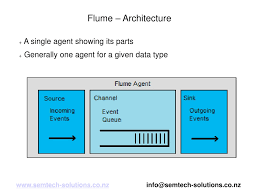
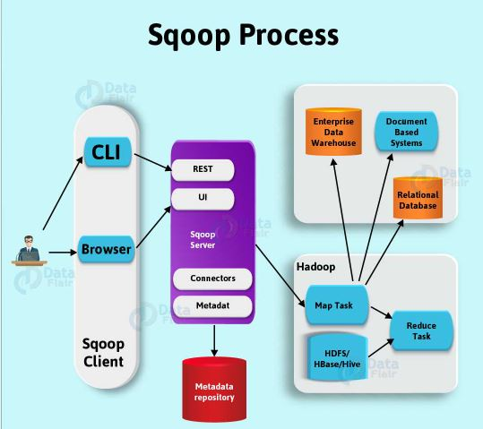

# Ashish's Portforlio
*Analytics Portfolio*

# [Project 1: Streaming data from its source to HDFS using Apache Flume](https://github.com/ashish73p/Hadoop/blob/main/flume.config)

**Steps in configuring your Apache Flume**
1. Open your Flume configuration file.
2. Name the components on the Flume agent.
3. Configure the source component to read data from a spool directory using the spooldir type.
4. Set the directory path where your source data files are located.
5. Enable the option to handle file headers if necessary.
6. Implement an interceptor to add a timestamp to each event.
7. Describe the sink component to send data to HDFS.
8. Specify the hdfs type for the sink.
9. Set the destination path in HDFS for storing the data, including dynamic folder creation based on date and time.
10. Define a prefix for each file name in HDFS.
11. Configure automatic file rotation.
12. Choose a channel type for buffering events in memory.
13. Use the memory type channel with specified capacity and transaction capacity.
14. Bind the source and sink components to the channel.
15. Save the changes to your Flume configuration file.
16. Start the Flume agent using the configured settings.
17. Monitor the Flume logs and HDFS directory to ensure successful data transfer.

**Apache Flume Architecture**

## [Project 2: Importing data from your Ms sql to Hadoop file system using sqoop]

**Steps in configuring**
Follow below steps

**Sqoop Architecture**

